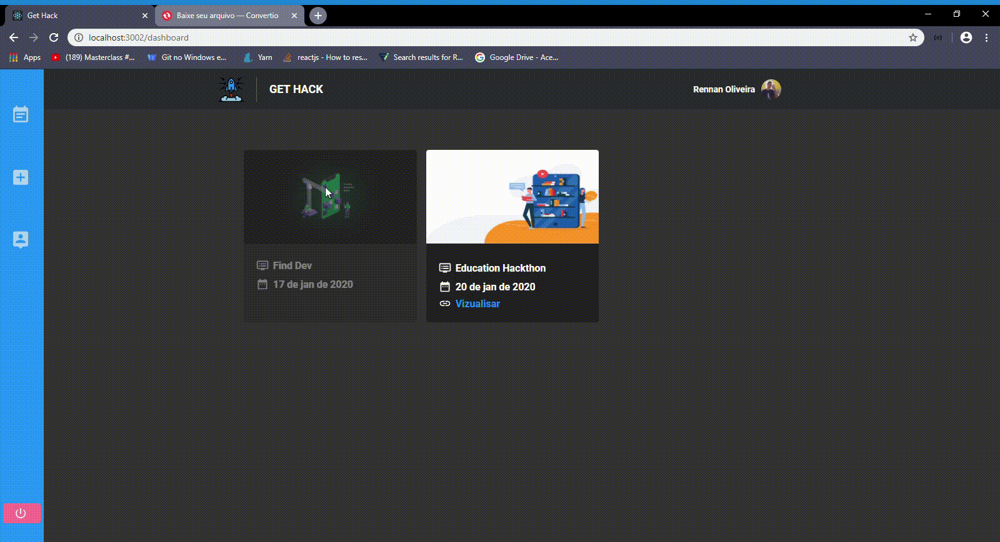

<h1 align="center" background="#2193f6">
    
</h1>

<h3 align="center">
    Rockethack, organize your hackathons quickly and conveniently.
</h3>

<p align="center">
    Application developed using Node.js with PostgresSQL for backend, 
    ReactJs for web application using FLUX architecture 
    with, Redux and Redux Saga.
</p>

# ❗️ Requisites

- [Node](https://nodejs.org/en/)
- [Yarn](https://yarnpkg.com/lang/en/)

# 💾 Backend

For the backend we will use [Node.Js](https://yarnpkg.com/lang/en/)

## Api documentation

To init backend, see api's documentation [here](./backend/README.md)

# 💻 Web Application

<h1 align="center">
    
</h1>

<h3 align="center">
    Manage your Hackathons here.
</h3>

## ⚡️ Start

To init this app, run:

```bash
$ cd frontend
$ yarn install
$ yarn start
```

or using npm:

```bash
$ cd frontend
$ npm install
$ npm start
```

### Demo

<h1 align="center">

</h1>
