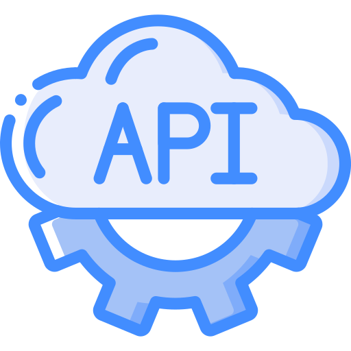

<h1 align="center">
    
</h1>

<h3 align="center">
ROCKETHACK - API
</h3>

<p align="center">
Rockethack application backend.
Application developed as a study, the backend is made in Node.Js with PostgresSQL.
</p>

## Installation

Use the package manager [yarn](https://yarnpkg.com/lang/en/) or npm to install.

### Using Yarn, run:

```bash
$ yarn install
```

### Using Npm, run:

```bash
$ npm install
```

## Usage

Install the [docker](https://www.docker.com/) to run postgres and redis.

Now run the commands to start containers.

```bash
$ docker run --name some-postgres -e POSTGRES_PASSWORD=mysecretpassword -d postgres
```

```bash
$ docker run --name some-redis -d redis
```

### Environment variables

For environment variables, use the .env.example file as a base.

### Test Mail

Use [Mailtrap](https://mailtrap.io/) for testing your emails.

### Create the database

```bash
$ yarn sequelize db:migrate
```

## Usage Routes:

- [User](./docs/AUTH.md)
- [Files](./docs/FILES.md)
- [Hackathons](./docs/ORGANIZER.md)
- [Subscription](./docs/USER.md)

## Contributing

Pull requests are welcome. For major changes, please open an issue first to discuss what you would like to change.

Please make sure to update tests as appropriate.

## License

[MIT](./LICENSE.md)
